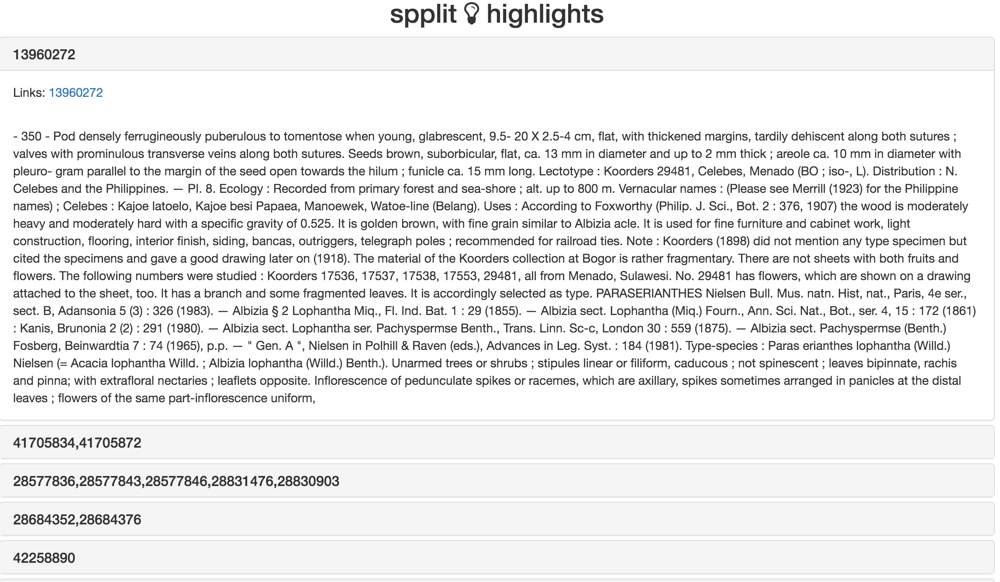

<!--
%\VignetteEngine{knitr::knitr}
%\VignetteIndexEntry{Introduction to spplit}
%\VignetteEncoding{UTF-8}
-->


Introduction to spplit
======================

A typical workflow looks like:

* Search for occurrences from GBIF or iDigBio
* Get a species list
* Get BHL metadata
* Get BHL OCR'ed text
* Save text to disk for later use - OR - analyze data

A note about pipes: pipes (`%>%`) are a relatively new thing in R. They make constructing
what you want to do in R much easier, and should be easier for others to read as well.
We use pipes in examples here, but you don't have to use pipes.

## load spplit


```r
library("spplit")
```

## Get occurrences

In this example, we'll do a geospatially defined query. You can also do a query based on taxonomic
names, or a combination of geometry and taxonomic names.

Define a WKT string. For more about gemoetry queries, see the `Geospatial Queries` vignette.


```r
wkt <- 'POLYGON((-124.07 41.48,-119.99 41.48,-119.99 35.57,-124.07 35.57,-124.07 41.48))'
```

Use `sp_occ_idigbio()` to execute a query against iDigBio data. For brevity we're limiting
to 3 results, but you can set it at whatever you like, keeping in mind that the larger
the `limit` value, the longer the query will take.

By default we're using the botany collection from the CalAcademy. If perhaps searching across
all collections makes more sense let me know and we can change that. You can easily change the
CalAcademy collection being searched with the `cas_coll` parameter.


```r
res <- sp_occ_idigbio(geometry = wkt, limit = 3)
res
#> Geometry [<geo1> (3)] 
#> Source: local data frame [3 x 77]
#> 
#>                                    name longitude latitude    prov
#>                                   <chr>     <dbl>    <dbl>   <chr>
#> 1              draba aureola  s. watson -121.4667 40.45940 idigbio
#> 2 beckmannia syzigachne  (steud.) fern. -122.8383 38.46425 idigbio
#> 3    albizia lophantha  (willd.) benth. -122.4583 37.75833 idigbio
#> Variables not shown: barcodevalue <lgl>, basisofrecord <chr>, bed <lgl>,
#>   catalognumber <chr>, class <chr>, collectioncode <chr>, collectionid
#>   <lgl>, collectionname <lgl>, collector <chr>, commonname <lgl>,
#>   continent <chr>, coordinateuncertainty <lgl>, country <chr>, countrycode
#>   <chr>, county <chr>, datecollected <date>, datemodified <chr>, dqs
#>   <dbl>, earliestageorloweststage <lgl>, earliestepochorlowestseries
#>   <lgl>, earliesteraorlowesterathem <lgl>, earliestperiodorlowestsystem
#>   <lgl>, etag <chr>, eventdate <lgl>, family <chr>, fieldnumber <lgl>,
#>   flags <list>, formation <lgl>, gbif_cannonicalname <lgl>, gbif_genus
#>   <lgl>, gbif_specificepithet <lgl>, gbif_taxonid <lgl>, genus <chr>,
#>   geoshape <lgl>, group <lgl>, hasImage <lgl>, hasMedia <lgl>, highertaxon
#>   <chr>, individualcount <lgl>, infraspecificepithet <lgl>,
#>   institutioncode <chr>, institutionid <chr>, institutionname <lgl>,
#>   kingdom <chr>, latestageorhigheststage <lgl>, latestepochorhighestseries
#>   <lgl>, latesteraorhighesterathem <lgl>, latestperiodorhighestsystem
#>   <lgl>, lithostratigraphicterms <lgl>, locality <chr>,
#>   lowestbiostratigraphiczone <lgl>, maxdepth <lgl>, maxelevation <dbl>,
#>   mediarecords <lgl>, member <lgl>, mindepth <lgl>, minelevation <dbl>,
#>   municipality <lgl>, occurrenceid <chr>, order <chr>, phylum <chr>,
#>   recordids <list>, recordnumber <chr>, recordset <chr>, specificepithet
#>   <chr>, startdayofyear <int>, stateprovince <chr>, typestatus <lgl>, uuid
#>   <chr>, verbatimeventdate <chr>, verbatimlocality <lgl>, version <lgl>,
#>   waterbody <lgl>.
```

## Get a species list

After getting back some occurrence data, but before getting some data from the BHL, we need
a species list because there's no point in sending duplicate queries to BHL.


```r
spplist <- res %>% sp_list()
spplist
#> [1] "albizia lophantha"     "beckmannia syzigachne" "draba aureola"
```

## Get BHL metadata

For BHL, we first need to search BHL for the species list we just made. Some taxa may be in
BHL and some may not. The returned data we'll get in this step will contain the information
we need to get pages from texts that contain information about the taxa of interest.


```r
bhldat <- spplist %>% sp_bhl_meta()
bhldat
#> <bhl metadata>
#>   Count: 3
#>   taxon / no. items / total pages [1st 10]: 
#>     albizia lophantha / 10 / 21
#>     beckmannia syzigachne / 121 / 260
#>     draba aureola / 31 / 47
```

You can combine BHL metadata into a data.frame for easier viewing/manipulation:


```r
as_df(bhldat)
#> $`albizia lophantha`
#> Source: local data frame [21 x 31]
#> 
#>    ItemID PrimaryTitleID ThumbnailPageID           Source
#>     <int>          <lgl>           <lgl>            <chr>
#> 1   49423             NA              NA Internet Archive
#> 2  130257             NA              NA Internet Archive
#> 3  130257             NA              NA Internet Archive
#> 4   90643             NA              NA Internet Archive
#> 5   90643             NA              NA Internet Archive
#> 6   90643             NA              NA Internet Archive
#> 7   91490             NA              NA Internet Archive
#> 8   91490             NA              NA Internet Archive
#> 9   91178             NA              NA Internet Archive
#> 10  91178             NA              NA Internet Archive
#> ..    ...            ...             ...              ...
#> Variables not shown: SourceIdentifier <chr>, Volume <chr>, Year <lgl>,
#>   Contributor <chr>, Sponsor <lgl>, Language <lgl>, LicenseUrl <lgl>,
#>   Rights <lgl>, DueDiligence <lgl>, CopyrightStatus <lgl>, CopyrightRegion
#>   <lgl>, ExternalUrl <lgl>, ItemUrl <chr>, TitleUrl <lgl>, ItemThumbUrl
#>   <lgl>, Parts <lgl>, Collections <lgl>, PageID <int>, Issue <chr>,
#>   PageUrl <chr>, ThumbnailUrl <chr>, FullSizeImageUrl <chr>, OcrUrl <chr>,
#>   OcrText <lgl>, PageTypes <list>, PageNumbers <list>, Names <lgl>.
#> 
#> $`beckmannia syzigachne`
#> Source: local data frame [260 x 31]
#> 
#>    ItemID PrimaryTitleID ThumbnailPageID           Source
#>     <int>          <lgl>           <lgl>            <chr>
#> 1  120919             NA              NA Internet Archive
#> 2   69217             NA              NA Internet Archive
#> 3  115257             NA              NA Internet Archive
#> 4  114250             NA              NA Internet Archive
#> 5   63628             NA              NA Internet Archive
#> 6  120746             NA              NA Internet Archive
#> 7  120746             NA              NA Internet Archive
#> 8  120746             NA              NA Internet Archive
#> 9   89178             NA              NA Internet Archive
#> 10  89179             NA              NA Internet Archive
#> ..    ...            ...             ...              ...
#> Variables not shown: SourceIdentifier <chr>, Volume <chr>, Year <lgl>,
#>   Contributor <chr>, Sponsor <lgl>, Language <lgl>, LicenseUrl <lgl>,
#>   Rights <lgl>, DueDiligence <lgl>, CopyrightStatus <lgl>, CopyrightRegion
#>   <lgl>, ExternalUrl <lgl>, ItemUrl <chr>, TitleUrl <lgl>, ItemThumbUrl
#>   <lgl>, Parts <lgl>, Collections <lgl>, PageID <int>, Issue <chr>,
#>   PageUrl <chr>, ThumbnailUrl <chr>, FullSizeImageUrl <chr>, OcrUrl <chr>,
#>   OcrText <lgl>, PageTypes <list>, PageNumbers <list>, Names <lgl>.
#> 
#> $`draba aureola`
#> Source: local data frame [47 x 31]
#> 
#>    ItemID PrimaryTitleID ThumbnailPageID           Source
#>     <int>          <lgl>           <lgl>            <chr>
#> 1   87374             NA              NA Internet Archive
#> 2   87374             NA              NA Internet Archive
#> 3   87374             NA              NA Internet Archive
#> 4  126935             NA              NA Internet Archive
#> 5   93711             NA              NA Internet Archive
#> 6   93711             NA              NA Internet Archive
#> 7   62964             NA              NA Internet Archive
#> 8   74748             NA              NA Internet Archive
#> 9   69300             NA              NA Internet Archive
#> 10   8002             NA              NA Internet Archive
#> ..    ...            ...             ...              ...
#> Variables not shown: SourceIdentifier <chr>, Volume <chr>, Year <lgl>,
#>   Contributor <chr>, Sponsor <lgl>, Language <lgl>, LicenseUrl <lgl>,
#>   Rights <lgl>, DueDiligence <lgl>, CopyrightStatus <lgl>, CopyrightRegion
#>   <lgl>, ExternalUrl <lgl>, ItemUrl <chr>, TitleUrl <lgl>, ItemThumbUrl
#>   <lgl>, Parts <lgl>, Collections <lgl>, PageID <int>, Issue <chr>,
#>   PageUrl <chr>, ThumbnailUrl <chr>, FullSizeImageUrl <chr>, OcrUrl <chr>,
#>   OcrText <lgl>, PageTypes <list>, PageNumbers <list>, Names <lgl>.
```

Note how each taxon gets a different data.frame. You can combine them all into one via
something like `dplyr::bind_rows()`.

## Get OCR text

Now that we have metadata, we want to get OCR pages - or text of digitized pages that has
been generated through Optical Character Recognition.


```r
ocrdat <- bhldat %>% sp_bhl_ocr()
ocrdat
#> $`albizia lophantha`
#> <bhl ocr'ed text>
#>   Count: 10
#>   no. pages / total character count [1st 10]:
#>     1 / 2826
#>     2 / 7498
#>     5 / 18561
#>     2 / 5010
#>     1 / 6238
#>     1 / 3305
#>     1 / 2052
#>     1 / 4135
#>     6 / 20270
#>     1 / 2257
#>
#> $`beckmannia syzigachne`
#> <bhl ocr'ed text>
#>   Count: 121
#>   no. pages / total character count [1st 10]:
#>     1 / 1682
#>     2 / 6801
#>     1 / 2456
#>     1 / 1600
#>     3 / 7152
#>     21 / 79223
#>     1 / 35
#>     1 / 3224
#>     1 / 2750
#>     1 / 1826
#>
#> $`draba aureola`
#> <bhl ocr'ed text>
#>   Count: 31
#>   no. pages / total character count [1st 10]:
#>     3 / 10860
#>     1 / 2620
#>     2 / 5764
#>     1 / 3838
#>     1 / 3838
#>     1 / 3877
#>     1 / 1847
#>     1 / 2272
#>     1 / 3774
#>     1 / 3234
```

Note that the OCR text we get back has essentially no structure. It's simply plain
text, and there's little metadata to work with.

You can view the pages with a utility in this package, which will open a separate browser
tab in your default browser for each taxon. Each taxon page has a different panel
for each BHL item, where each item can have many pages.


```r
viewer(ocrdat)
```



Note that right now the text is all concatentated together - I am working on making it
prettier. Let me know if you think this viewer is useful.

## Save text to disk

After all the work above, you'll likely want to save the OCR pages to disk before quitting
your R session.


```r
sp_bhl_save(ocrdat)
#> ocr text written to files in ./albizia_lophantha
#> ocr text written to files in ./beckmannia_syzigachne
#> ocr text written to files in ./draba_aureola
```

By default, `sp_bhl_save()` saves each each taxon to a separate folder, where each taxon
folder will have every page as a separate file. In cases where it's ambiguous what the
name of the folder should be we give it a random alphanumeric string for a name.

